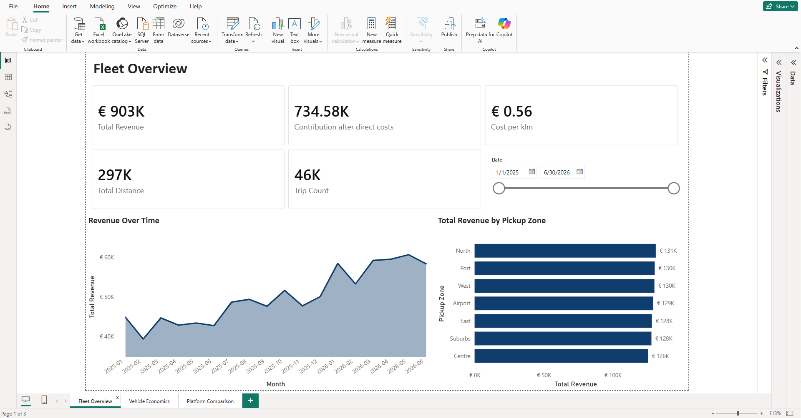
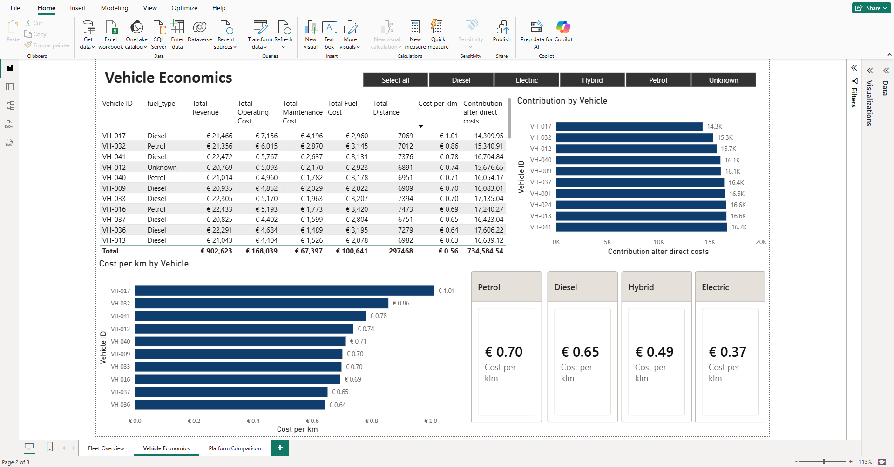
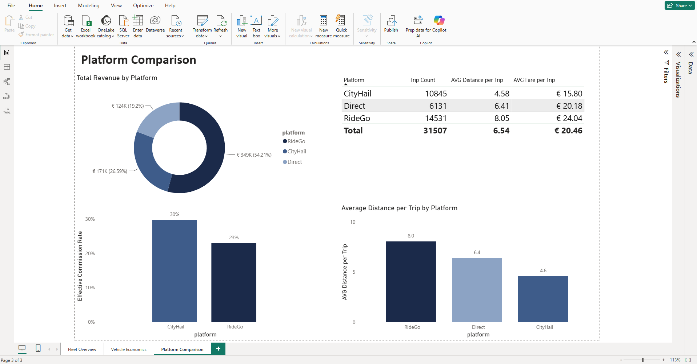

# Meridian Fleet Services — Fleet Analytics Dashboard

An end-to-end analytics project built in **Power BI**, taking seven messy operational source files through profiling, cleaning, data modelling, and reporting to answer a simple business question: **where is this taxi fleet making and losing money, and what should be done about it?**

> **Note on the data:** Meridian Fleet Services is a fictional company and the dataset is synthetic. It was designed to reproduce the kinds of defects and inconsistencies found in real operational systems (mixed date formats, inconsistent encodings, orphaned keys, duplicate records) so the cleaning and modelling work reflects real conditions.

---

## Dashboard

**Fleet Overview** — headline KPIs, an 18-month revenue trend, and revenue by pickup zone, with an interactive date filter.



**Vehicle Economics** — a per-vehicle cost and contribution breakdown, plus cost-per-km by fuel type, with an interactive fuel-type filter.



**Platform Comparison** — how the fleet's three booking channels compare on revenue, effective commission, and trip profile.



---

## Key findings

**1. Electric vehicles cost roughly half as much per km as petrol.**
All-in running cost is about **€0.37/km for electric** versus **€0.70/km for petrol**, with hybrid and diesel in between. This is a direct input to future purchasing decisions.

**2. VH-017 is the fleet's most expensive vehicle to run — a cost problem.**
At **€1.01/km all-in**, VH-017 sits well above the fleet, driven almost entirely by an anomalous maintenance bill (**€4,196** vs a typical €1,300–3,000). It earns enough to avoid being the worst overall performer, so the right action is to **investigate and service it**, not retire it.

**3. VH-032 is the lowest contributor — but for the opposite reason.**
VH-032 has the **lowest contribution after direct costs**, yet it is *not* especially costly to run. Its problem is **low revenue and low distance** — it is underused. The two weakest vehicles therefore need **different interventions**: service VH-017, but **reassign or retire VH-032**.

**4. The cheaper-looking booking platform is actually the more expensive one.**
CityHail advertises a lower headline commission (18%) than RideGo (23%), but once its **fixed weekly fees** are included, its **effective** commission rate rises to **~30%** — above RideGo's 23%. RideGo also supplies **longer, higher-value trips** (8.0 km / €24 average vs CityHail's 4.6 km / €16). RideGo is the better partner on both cost and trip value.

---

## Approach

| Stage | Tool | What happened |
|---|---|---|
| **Profiling** | Python / pandas | Profiled all seven source files, documented every defect and cross-file integrity issue before touching Power BI. |
| **Cleaning** | Power Query | Handled decimal-comma locales, currency prefixes, a semicolon-delimited export, header banners, mixed date formats, duplicates, and impossible values. Three trip exports with drifting schemas were reconciled and appended into one table. |
| **Modelling** | Power BI | Built a star schema: a central `Trips` fact table linked to `Vehicles`, `Drivers`, and a date dimension, with `Fuel` and `Maintenance` hanging off `Vehicles`. Platform payouts were kept as a separate table at their own (weekly, per-platform) grain. |
| **Measures** | DAX | Revenue, distance, cost per km, direct operating cost, contribution after direct costs, and effective commission rate — all built to compose from one another and divide safely. |
| **Reporting** | Power BI | Three report pages with interactive slicers. |

### Notes on honesty and scope
- Costs in this dataset cover **fuel and maintenance only**. They are labelled throughout as **direct operating costs** — never "total cost" or "profit" — because driver pay, insurance, and depreciation are not in the source data.
- Synthetic cost figures were calibrated to realistic per-km fleet-operating benchmarks so the numbers are plausible rather than arbitrary.

---

## Repository contents

```
├── README.md                     ← this case study
├── Meridian_Fleet.pbix           ← the Power BI report
├── 01_profiling.ipynb            ← pandas profiling of the raw source files
├── data_quality_log.md           ← every defect found, and how it was handled
├── specification.md              ← the one-page project brief
├── requirements.txt              ← Python dependencies for the profiling notebook
├── data/                         ← the seven synthetic source files
└── screenshots/                  ← the three report pages
```

## Opening the report
The `.pbix` opens in the free [Power BI Desktop](https://www.microsoft.com/power-platform/products/power-bi/desktop). To re-run the profiling notebook, install the dependencies in `requirements.txt`.
